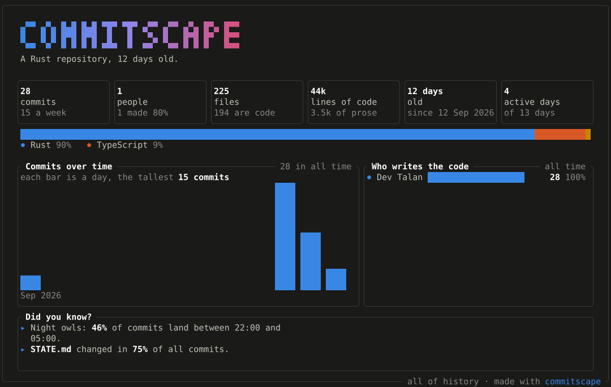
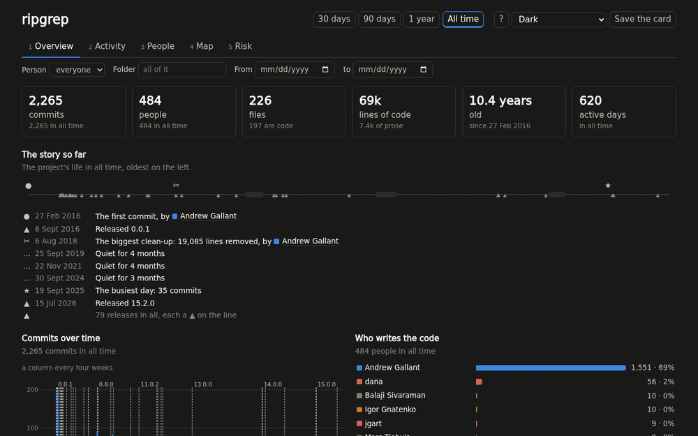
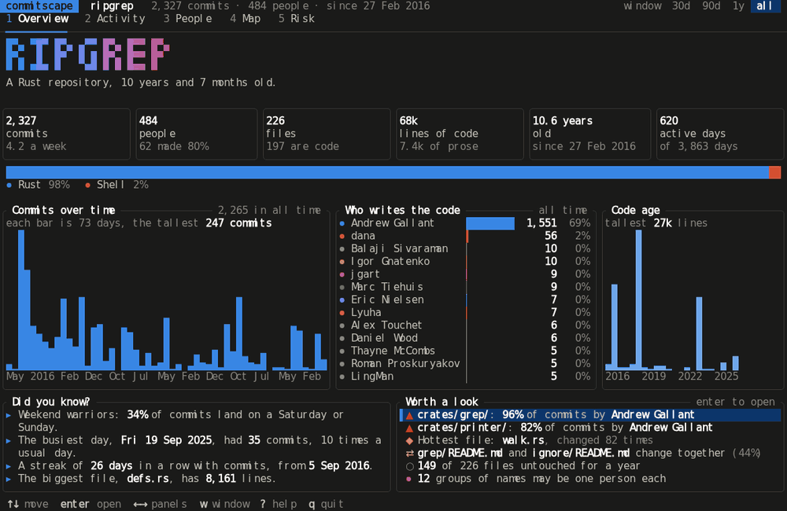

# commitscape

Reads a git repository and shows what changes what you do next: who knows
the code, what is risky to change, what you probably forgot, and the
project's story. All of it on your machine, from git's own history, in a
second.



```sh
npx commitscape            # in any git repository
```

It opens in your browser, or in the terminal where no browser can be
opened. The first run reads the whole history (about 25 seconds for a
repository the size of rust-lang/rust); after that it opens in well under
a second.



## Install

| How | Command |
|---|---|
| npm | `npx commitscape`, or `npm install -g commitscape` |
| Homebrew | `brew install pixelactstudio/commitscape/commitscape` |
| Nix | `nix run github:pixelactstudio/commitscape`, or add the flake |
| From source | `cargo build --release` (the web app first: `cd web && npm ci && npm run build`) |

The npm package is a small starter and one prebuilt binary for your
platform (Linux on x64 and ARM, glibc or musl; macOS on Intel and Apple;
Windows on x64). Nothing runs at install time, and nothing needs Node once
it is running.

## What it shows

| Screen | Shows |
|---|---|
| 1 Overview | The project's story on a line (its first commit, releases, people joining and leaving, the busiest day, the biggest clean-up, quiet stretches), commits over time, who writes the code, what is unusual, and what is worth a look |
| 2 Activity | Commits over time by person with releases marked, pull requests and issues a week, the hours of the week, and what kind of work it was |
| 3 People | One table, a column per measure and no single score: commits, active days, lines added and removed, folders that depend on them, pull requests and reviews. A profile for each, where a wrong merge of two people can be undone |
| 4 Map | The code as nested blocks sized by lines, coloured by how often, when last, or who changes it. Click a file to see what changes with it |
| 5 Risk | Files changed often and deeply nested, groups of files that change together, and folders one person holds, with who could take each over |

Every number is explained under `?`. A row of filters narrows every screen
to one person, one folder or a range of dates, and the theme follows your
system, or choose Light, Dark or Midnight.

The terminal interface has the same five screens:



## Questions it answers

**What did I forget?** Before you commit, `commitscape check` names the
files that nearly always change with the ones you staged, with the
evidence, and says nothing when the evidence is weak:

```text
$ commitscape check
Probably forgotten:
  You changed src/schema.ts. 9 of the last 10 commits that did also changed a file in migrations/.
```

`--branch main` checks a branch, `--pr 123` a pull request, `--commit REV`
one past commit, and `--strict` exits with 1 when something looks
forgotten. The [`actions/check`](actions/check/README.md) GitHub Action
comments it on pull requests.

**Who do I ask?** `commitscape who src/api` lists who worked on a file or
folder most, and most recently, flags anyone who has stopped committing,
and names who to ask instead.

**Can I rely on this project?** `commitscape health owner/name` keeps a
partial clone of a GitHub project in the cache and says whether it is alive
and whether it depends on one person: its maintainers in the last 90 days,
its bus factor, how often it releases, how fast issues get a first answer,
and whether it is getting busier or quieter.

**What did I do this year?** `commitscape wrapped ~/code` finds every
repository under a folder, keeps only your commits, under every address
you commit with, and writes your year as a page and a card: commits,
lines, languages, your busiest day and longest streak, and the hours you
work. Private repositories are included, and nothing is uploaded.

## Over SSH

- **VS Code or Cursor over Remote-SSH:** run `commitscape`; the editor
  opens the page on your laptop and forwards the port.
- **Plain ssh:** run `commitscape --web` on the server and paste the
  `ssh -N -L …` line it prints on your laptop, then open the link there.
- **Tailscale or a LAN:** `commitscape --web --listen 100.x.y.z`.
- `--tui` always opens the terminal interface.

The page is served on `127.0.0.1` with a secret token in its link, and the
server answers only to the address it printed.

## Share it

```sh
commitscape card .          # the card above, as an SVG: <repository>-card.svg
commitscape report .        # the whole browser interface as one HTML file, to send or keep
```

The [`actions/card`](actions/card/README.md) GitHub Action keeps a
repository's card in its README up to date. "Save the card" in the browser
saves it as a PNG.

## What leaves your machine

Nothing, unless GitHub is asked. With the [GitHub CLI](https://cli.github.com)
signed in, commitscape asks GitHub (through `gh`) about the repository's
stars, pull requests, issues, reviews and releases, and which account made
which commit. `--offline` never asks. `health` clones the project it is
given with git.

## Other ways to run it

```sh
commitscape --window 1y .          # start on 30d, 90d, 1y or all
commitscape --summary .            # a plain-text summary
commitscape --json . > report.json # every metric as one JSON document
commitscape github .               # fetch GitHub's whole history now
commitscape --help                 # every option
```

The JSON document's Window ends at the newest commit rather than now, so the
same repository always gives the same document. The cache lives in your
platform's cache directory (`~/.cache/commitscape` on Linux); `--no-cache`
skips it and `--cache-dir` moves it.

<details>
<summary>The terminal interface's keys</summary>

| Key | Does |
|---|---|
| `1` to `5`, `←` `→`, Tab | Choose a screen |
| `↑` `↓`, `j` `k`, PgUp, PgDn, Home, End | Move through a list |
| Enter | Open what is selected: a file, a pair of files, a folder, a person |
| Esc | Go back |
| `w`, `W` | Step the Window: 30 days, 90 days, a year, all of history |
| `/` | Find a file, folder or person in a list |
| `c` | Colour the Map by activity, age or owner |
| `u` | On a person: undo a merge of their identities, or redo it |
| Mouse | Click a screen, a Window, a row or a Map block; the wheel scrolls |
| `t` | Colours: the terminal's own, dark, or light |
| `?` | Help: what the screen shows and what every word means |
| `q` | Quit |

</details>

## Develop

```sh
(cd web && npm ci && npm run build)  # the browser interface, which cargo build embeds
cargo xtask fixtures --force         # the small repositories the tests read
cargo test --workspace               # every test
cargo xtask check-layering           # the crate layering ADR-0001 depends on
(cd web && npm run typecheck && npm run lint && npm test && npm run e2e)
cargo xtask bench                    # timings; needs clones in ../.commitscape-bench
cargo xtask preview path/to/repo     # every terminal screen as SVG and PNG
```

A tag `v<version>` releases: `.github/workflows/release.yml` builds the six
binaries, publishes the npm packages (`cargo xtask npm` writes them) and
makes a GitHub release with the Homebrew formula.

`CONTEXT.md` defines the terms, `docs/adr/` records the decisions,
`docs/fixtures.md` works out the values the tests assert, and `STATE.md` is
the build log with every measured number.

commitscape is built in the open with AI coding agents; the build log says
what each phase did and how it was checked.

Licensed under either of [MIT](LICENSE-MIT) or [Apache-2.0](LICENSE-APACHE),
at your option.
