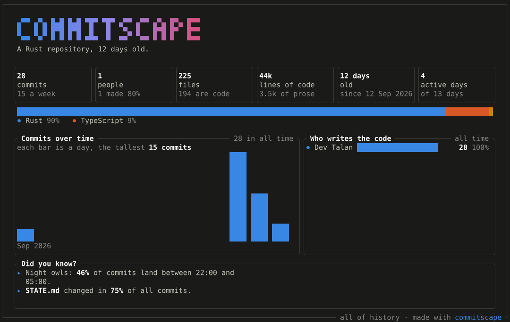

<div align="center">
  
  <h1>commitscape</h1>
  <p>What you have built, how you stand next to the people you work with, and cards to share it.</p>
</div>

<p align="center">
  <a href="https://github.com/pixelactstudio/commitscape/actions/workflows/ci.yml">
    
  </a>
  <a href="https://github.com/pixelactstudio/commitscape/actions/workflows/docker.yml">
    
  </a>
  <a href="#license">
    
  </a>
</p>

commitscape shows a developer what they have built: pull requests merged,
reviews given, and the lines of theirs that still run, counted from each
repository's own history with blame. It shows how they stand next to the
people they work with, view by view and never by one score, and turns it
into Cards for a README, a self-review or a post. On your machine it reads
the whole history of a large repository in seconds, from git's own data.



There are two ways to use it:

1. **From your terminal.** Run `npx commitscape` in any git repository. It
   says what it will upload and asks first (Enter means yes), reads the
   history on your machine, uploads the Report encrypted and opens its link
   in your browser. The link works for 4 hours, and the Site cannot read
   what it stores.
2. **On the Site.** Type any GitHub username for their Profile: totals,
   Surviving Lines, Archetype and Achievements, where their work is, Cards
   to embed, Proof of Work for a period, Versus, Rivals, Races, Crews and
   Wrapped. Paste a repository link for its Report and Standings, sign in
   with GitHub to see your own private work, or browse the Leaderboards.
   Anyone can stay out of comparisons.

The project is in early development. The CLI and the Site work end to end.

## Getting started

```sh
npx commitscape
```

```text
This uploads my-project's Report to https://commitscape.damnlabs.com.
  It holds file paths, people's names and GitHub logins, and commit subjects. No email addresses.
  It is locked with a key only the link holds, so the Site cannot read it.
  The link works for 4 hours.
Upload it? [Y/n]
https://commitscape.damnlabs.com/s/k3f9q2x7#0dbf…
```

`--no-open` prints the link without opening a browser, `--yes` uploads
without asking (for scripts; it never opens a browser), and `--expires 12`
keeps the link up for 12 hours. `commitscape share --list` lists the links
this machine made and `--delete <link>` takes one down.

## Install

| How | Command |
|---|---|
| npm | `npx commitscape`, `pnpm dlx commitscape`, or `npm install -g commitscape` |
| Homebrew | `brew install pixelactstudio/commitscape/commitscape` |
| winget | `winget install DevTalan.Commitscape` |
| Scoop | `scoop bucket add pixelactstudio https://github.com/pixelactstudio/scoop-bucket`, then `scoop install commitscape` |
| Arch (AUR) | `yay -S commitscape-bin` |
| Debian, Ubuntu | the `.deb` from the [latest release](https://github.com/pixelactstudio/commitscape/releases/latest): `sudo apt install ./commitscape_*_amd64.deb` |
| Fedora, RHEL | the `.rpm` from the latest release: `sudo dnf install ./commitscape-*.x86_64.rpm` |
| Cargo | `cargo install commitscape` |
| Nix | `nix run github:pixelactstudio/commitscape` |
| A binary | the archive for your platform from the latest release |

Prebuilt binaries cover Linux on x64 and ARM (glibc or musl), macOS on
Intel and Apple silicon, and Windows on x64. The npm package installs only
your platform's binary, runs nothing at install time, and needs no Node
once it runs.

## Commands

| Command | What it does |
|---|---|
| `commitscape [path]` | The same as `commitscape share`: asks, uploads the encrypted Report and opens its link |
| `commitscape share [path]` | An encrypted link to this repository's Report, for any browser; `--list` and `--delete <link>` manage them |
| `commitscape report [path]` | The Report as gzipped JSON, as the Site stores it; uploads nothing |
| `commitscape surviving [path] --person <id>` | A person's Surviving Lines: the lines at the head that blame gives them, reformats passed through |
| `commitscape health <owner/name>` | Whether a GitHub project is alive and whether it depends on one person |

`--help` on any command lists every option.

## Cards in a README

The [card action](./actions/card) keeps Cards from the Site in your
repository, up to date on a schedule:

```yaml
- uses: pixelactstudio/commitscape/actions/card@v1
  with:
    cards: |
      u/octocat/totals?theme=dark .github/cards/totals.svg
```

Or embed a Card's address from the Site directly; its Cards studio at
`/u/<login>/cards` gives the address for each.

## On the Site

- **Any public GitHub repository.** Go to `/gh/<owner>/<name>`. GitHub's
  facts show at once, and the Report follows when its history is read:
  seconds for most repositories.
- **Your own repositories.** Sign in with GitHub and choose repositories
  through commitscape's GitHub App, which can only read. A private
  repository's Report is shown only to people GitHub says can see it.
- **Leaderboards.** Popular repositories ranked by what commitscape
  measures: resting on one person, most maintainers, most active, fastest
  to answer issues, and oldest code still running. Repositories only,
  never people.
- **For AI agents.** An MCP server at `/mcp` lets an agent look up a
  repository and read its Report.

`/privacy` on the Site says what it keeps, where, for how long, and who can
read it.

## Privacy

On your machine, commitscape sends nothing anywhere until you say yes:

- `share` (and a bare `commitscape`) uploads the Report encrypted with AES-256-GCM. The key is only in
  the link, after the `#`, which browsers never send, so the Site stores
  what it cannot read. No email address is ever included.
- `report` and `surviving` never use the network. `health` asks GitHub,
  through the [GitHub CLI](https://cli.github.com), about the project it is
  given.
- No analytics, no update checks, and nothing runs at install time.

## Self-hosting

The Site is a TanStack Start app and the Builder a small Node worker, both
published as Docker images on every merge. [DEPLOY.md](./DEPLOY.md) runs
them in Dokploy with Postgres and a Cloudflare R2 bucket.

## Development

Requirements: Rust (stable), Node.js 24, pnpm 12 and Docker.

```sh
git clone git@github.com:pixelactstudio/commitscape.git
cd commitscape
pnpm install
pnpm services
cargo xtask fixtures --force
cp apps/site/.env.example apps/site/.env
cp apps/builder/.env.example apps/builder/.env
pnpm dev:builder
pnpm dev:site
```

`pnpm services` starts Postgres and an S3 stand-in in Docker. Set
`BETTER_AUTH_SECRET` in `apps/site/.env` (`openssl rand -hex 32`). The Site
runs at [http://localhost:3100](http://localhost:3100). GitHub sign-in,
Sentry and PostHog stay off while their keys are empty.

| Command | Purpose |
|---|---|
| `cargo run -p commitscape -- report <path>` | Write a repository's Report with the CLI |
| `cargo test --workspace` | Every Rust test |
| `cargo clippy --workspace --all-targets -- -D warnings` | Rust lints |
| `cargo xtask check-layering` | Check that the crates depend on each other only as designed |
| `pnpm check` | Typecheck, lint, test and build every TypeScript package |
| `pnpm e2e` | The Site and the Builder end to end in Chromium, with accessibility checks |
| `pnpm db:generate` | Write the migration for a schema change |
| `cargo xtask bench` | Timings on large repositories |

## Architecture

| Folder | What |
|---|---|
| `crates/` | Rust: the engine that reads git, the metrics, the Report and the CLI |
| `apps/site/` | The Site: TanStack Start on Node, server-rendered, with Better Auth |
| `apps/builder/` | The Builder: takes Builds from a Postgres queue, clones the repository, runs `commitscape report`, stores the Report in R2 and its commits in Postgres |
| `packages/server/` | The database schema and migrations, R2 storage, the queue and stored Reports |
| `packages/ui/` | Every screen and chart the Site shows |
| `packages/data/` | The Report's types, generated from Rust |

- [Domain language](./CONTEXT.md)
- [Architecture decisions](./docs/adr)
- [Deploying](./DEPLOY.md)
- [How the pieces work together](./docs/working.md)
- [GitHub's API limits](./docs/github-api.md)
- [Releasing](./RELEASING.md)
- [Agent guide](./CLAUDE.md)

## Stack

- Rust, gix and imara-diff
- TanStack Start, React 19, TypeScript and Vite
- Astryx and Tailwind CSS
- PostgreSQL, Drizzle ORM, pg-boss and Cloudflare R2
- Better Auth, PostHog and Sentry
- Turborepo, oxlint, Vitest and Playwright

## Commit workflow

Commits and pull request titles use
[Conventional Commits](https://www.conventionalcommits.org/). Releases,
version numbers and the changelog are generated from them
([RELEASING.md](./RELEASING.md)):

```text
feat: count lines changed per person
fix: keep the Window when opening a file
chore: update dependencies
```

## License

commitscape is open-source software, licensed under either the
[MIT License](./LICENSE-MIT) or the [Apache License 2.0](./LICENSE-APACHE),
at your option.

An open-source project by [Pixelact Studio](https://pixelactstudio.com).
